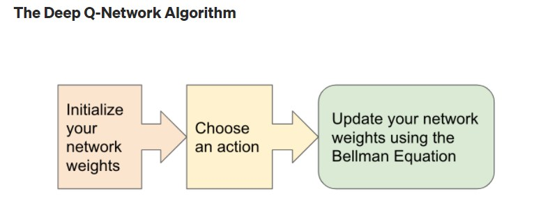

# Snake_multiplayer

This is the project of creating a AI for playing a modified version of Snake game with reinforcement learning.
Selected method is Deep Q-learning algorithm and project is implemented with ```PyGame``` and ```PyTorch``` using Python. 

## Usage

In order to start training from scratch, call:
```bash
python agent.py
```
If you want to resume training from a certain model version, input path to that model into ```config.py``` file. 

## Game 
Game is a modified version of Snake to create a multiplayer game (in fact only two players are available now) so that multiagent modelling could be implemented. 
Modification is inspired by slither.io and is entirely made up by me. 

### Game rules
* As a snake you can move in any direction and go through the walls (like in snake 2).
* A player gets points for eating food:  1 point for each *apple*.
* Collision is set as:
  * Moving with head into your own body.
  * Moving with head into your opponents body.
* Collision results in snakes disappearance. 
* When opponent hits you, you keep playing (like in slither.io).
* 180 degree turns are not possible, available actions are turning right or left or keep going straight (Null action).
* When both snakes disappear ("lose"), the game is over.
* A snake with most points wins.

The raw version of game controlled by arrows and WSAD is available in ```pysnake.py``` file. 

## Deep Q-learning
Deep Q-learning is a reinforcement learning algorithm that introduces neural network into traditional q-learning method.
Reinforcement learning is a branch of machine learning, that creates and train AI model (to do certain task) by enabling ```Agent``` 
to explore the environment. In each step, ```Agent``` chooses an action (random when untrained) and receives a reward for it. 
```Reward``` can be positive, zero or negative (a penalty then). ```Agents``` goal is to maximize the amount of rewards it's getting. 

Deep Q-learning as a modification of q-learning method relies on Bellman equation to update neural networks weights.
Procedure can be written in 3 steps:
1. Initialize neural network
2. Choose an action
3. Update network weight using Bellman equation



Bellman equation:
$$` Q^{new}(s,a) = Q(s,a) + \alpha [R(s,a) + \gamma \bullet max Q'(s',a') - Q(s,a)] `$$
where:

$Q(s,a)$ - current Q value

$\alpha$ - learning rate

$ R(s,a)$ - reward for taking action $a$ in state $s$

$\gamma $ - discount rate

But in this project, I'll use simplified version of Q-update where:
$$ Q = model.prediction(s_0)$$
$$ Q^{new} = R + \gamma \bullet max(model.prediction(s_1))$$

Loss function is Mean Squared Error between $Q$ and $Q^{new}$
$$Loss = (Q^{new}-Q)^2$$

Weights are updated with Adam optimizer.

## Environment
### State
Single state is made of 11 binary values:


* 3 values indicating if there's collision straight, right or left of snakes head
  * danger straight, 
  * danger right, 
  * danger left 

* 4 values indication movement direction
  * left
  * right
  * up
  * down
  
  Only one of above 4 variables can be 1, the rest must be 0. 

* 4 values of food placement
  * food left
  * food right
  * food up
  * food down

All these values put together in a single vector define game state for a snake.
For example vector :
$ [1,0,0, 0,1,0,0, 1,0,1,0]$ means that snake is going right, there's danger ahead and the food is somewhere north-west from its perpective.


### Action
From the perspective of a snake, there are 3 possible actions:
* go straight (NULL action)
* turn left
* turn right

Action is passed to a model as a binary vector of these 3 elements eg. [1,0,0] means going forward.

### Neural network model
Neural network is a simple feed forward network with one hidden layer. Input layer consists of
11 units, hidden layer is a 256-unit dense layer with ReLU activation function. The output is costructed 
with 3 units (action space dimension) with no activation function. Action is selected as an argmax of values in output vector.

The loss function is determined as mean square error of old $Q$ value and new, reward-based updated $Q^{new}$.

Weights are updated with Adam optimizer. 

### Rewards

Rewards are given for every action chosen by ```Agent```.
Assumed values are as such:
* +10 for eating food
* -10 for colliding with own body
* -20 for colliding with enemy
* -10 for no-progress (allowed time with no progress increases with snakes length)
* 0 otherwise


## Training

Training is done with a separate, public function. It begins with allocation some score tables and initiating ```Agents``` and ```game```.
Core part of training function is an infinite loop iterating through game steps. In each step, the following sequence is being done:
1. Get game states for both agents.
2. Choose actions ("simultaneously" - without knowing opponents action).
3. Play actions chosen by agents.
4. Check for collisions, eating food, game over.
5. Update model weights
6. Commit training sample to long term memory.
7. If game is over, retrain model with randomly chosen batch from a memory. A memory is shared between agents to evenly train both agents and to speed up creating a database.
8. Update scores and update a score plot. 
9. Reset the environment and start new game. 


## Coming soon ... 
* Evaluation methodology
* Results

## References
https://towardsdatascience.com/deep-q-learning-tutorial-mindqn-2a4c855abffc
https://www.youtube.com/watch?v=PJl4iabBEz0&list=PLqnslRFeH2UrDh7vUmJ60YrmWd64mTTKV

